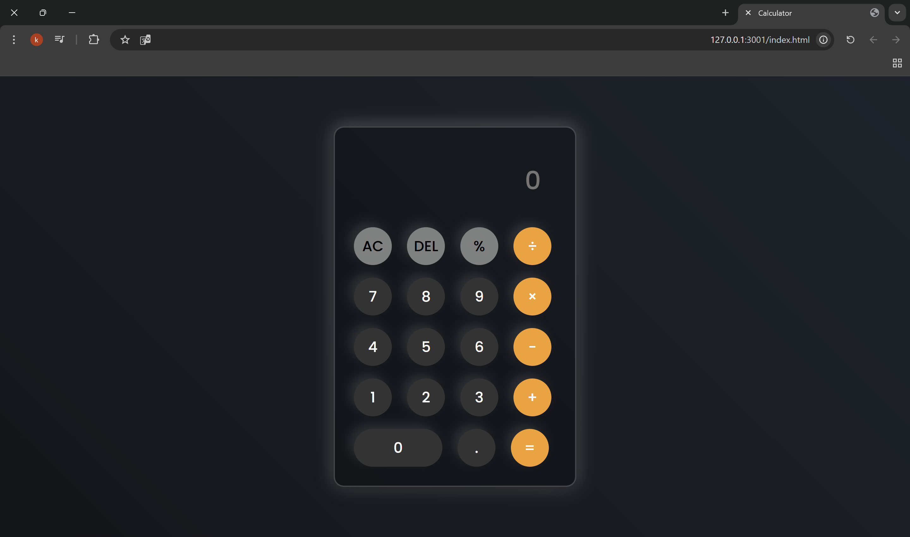

# Simple Calculator

This is a simple web-based calculator built using **HTML, CSS, and JavaScript**. It supports basic arithmetic operations such as addition, subtraction, multiplication, and division.

## 📌 Features
- Basic arithmetic operations (`+`, `-`, `×`, `÷`, `%`)
- Clear (`AC`) and delete (`DEL`) functionality
- Supports **keyboard input** for faster calculations
- Responsive and visually appealing UI
- Hover and click effects for buttons

## 🛠️ Technologies Used
- **HTML** for the structure
- **CSS** for styling and layout
- **JavaScript** for functionality

## 🚀 How to Use
1. Clone this repository.
2. Open `index.html` in your browser.
3. Use the buttons or your keyboard to perform calculations.

## 📷 Screenshot

